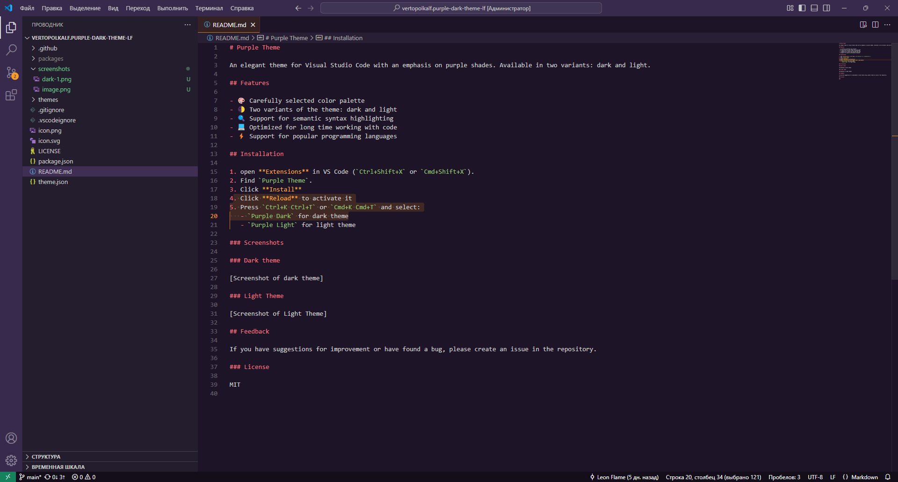
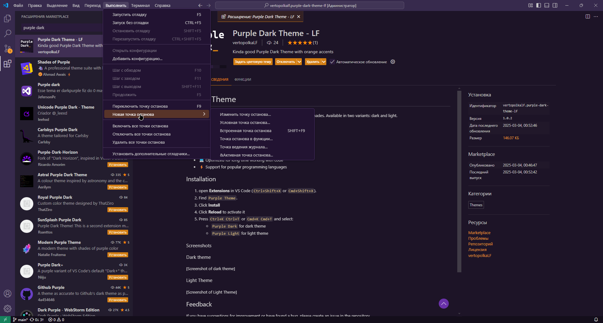
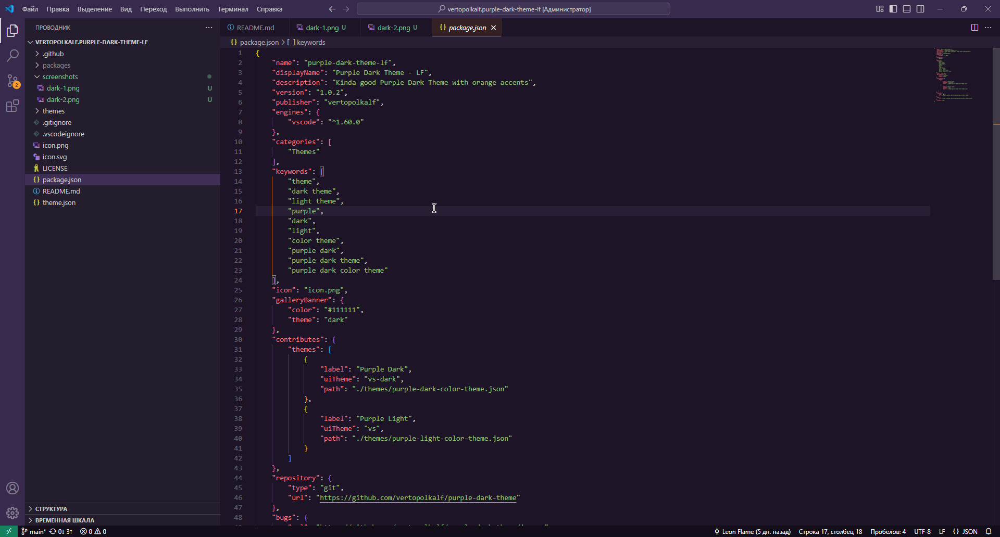
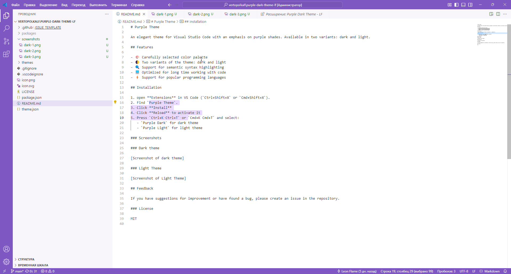

# Purple Dark Theme

An elegant theme for Zed with an emphasis on purple shades. Available in two variants: dark and light.

## Features

- Carefully selected color palette
- Two variants of the theme: dark and light
- Support for semantic syntax highlighting
- Optimized for long coding sessions
- Support for popular programming languages

## Installation

### Local dev install

1. Open Zed.
2. Run `zed: install dev extension`.
3. Select this folder:

   `C:\Dev\purple-dark-theme-lf`

4. Run `theme selector: toggle` and choose:
   - `Purple Dark`
   - `Purple Light`

### Publishing

See [PUBLISHING.md](./PUBLISHING.md) for the marketplace submission steps.

## Screenshots

### Dark Theme

### Light Theme

## Feedback

If you have suggestions for improvement or have found a bug, please create an issue in the repository.

## License

MIT
